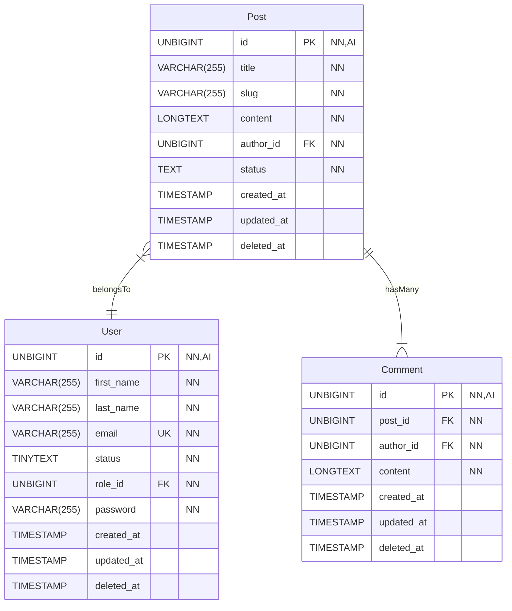

# SVEN General Template

```mermaid
erDiagram

    users [User] {
        UNBIGINT id PK "NN,AI"
        VARCHAR(255) first_name "NN"
        VARCHAR(255) last_name "NN"
        VARCHAR(255) email UK "NN"
        TINYTEXT status "NN"
        UNBIGINT role_id FK "NN"
        VARCHAR(255) password "NN"
        TIMESTAMP created_at
        TIMESTAMP updated_at
        TIMESTAMP deleted_at
    }

    posts [Post] {
        UNBIGINT id PK "NN,AI"
        VARCHAR(255) title "NN"
        VARCHAR(255) slug "NN"
        LONGTEXT content "NN"
        UNBIGINT author_id FK "NN"
        TEXT status "NN"
        TIMESTAMP created_at
        TIMESTAMP updated_at
        TIMESTAMP deleted_at
    }

    posts }|--|| users: belongsTo
    posts ||--|{ comments: hasMany

    comments [Comment] {
        UNBIGINT id PK "NN,AI"
        UNBIGINT post_id FK "NN"
        UNBIGINT author_id FK "NN"
        LONGTEXT content "NN"
        TIMESTAMP created_at
        TIMESTAMP updated_at
        TIMESTAMP deleted_at
    }


```
